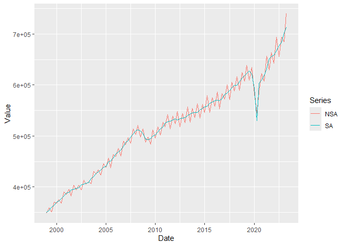

<!-- README.md is generated from README.Rmd. Please edit that file -->

# SAvalidation

<!-- badges: start -->
<!-- badges: end -->

SAvalidation provides simple functions for running validation checks on
seasonally adjusted time series and generating dashboards for further
analysis of validation checks.

## Installation

You can install the development version of SAvalidation like so:

``` r
# FILL THIS IN! HOW CAN PEOPLE INSTALL YOUR DEV PACKAGE?
```

## Example

This is a basic example which shows you how to solve a common problem:

``` r
library(SAvalidation)

data("data_to_check")

level1_validation(data_to_check$nsa,data_to_check$sa)
#> [1] "FAIL: EVIDENCE OF RESIDUAL SEASONALITY OR CALENDAR EFFECTS IN SA SERIES"
```

Create a plot from level 2 validation code

``` r
nsa_sa_plot(data_to_check$nsa,data_to_check$sa)
```


