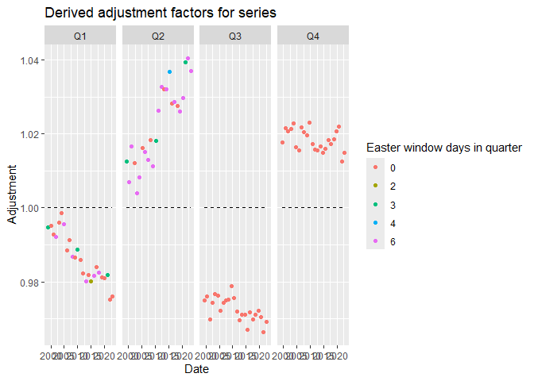

<!-- README.md is generated from README.Rmd. Please edit that file -->

# SAvalidation

<!-- badges: start -->
<!-- badges: end -->

SAvalidation provides simple functions for running validation checks on
seasonally adjusted time series and generating dashboards for further
analysis of validation checks.

## Installation

You can install the development version of SAvalidation like so:

``` r
# FILL THIS IN! HOW CAN PEOPLE INSTALL YOUR DEV PACKAGE?
```

## Example

This is a basic example which shows you how to solve a common problem:

``` r
library(SAvalidation)

level1_validation(data_to_check$nsa,data_to_check$sa)
#> [1] "FAIL: EVIDENCE OF RESIDUAL SEASONALITY OR CALENDAR EFFECTS IN SA SERIES"
```

A level 2 validation report can be created with `level2_validation()`
which returns an html dashboard either in current working directory or a
user specified directory

``` r

level2_validation(data_to_check$nsa,data_to_check$sa,data_to_check$name)
```

Can also create plots from level 2 validation code for example the NSA
against the SA

``` r
nsa_sa_plot(data_to_check$nsa,data_to_check$sa)
```


Or the derived adjustment factor plot

``` r
adjust_fact_plot(data_to_check$nsa,data_to_check$sa)
#> Joining with `by = join_by(quarter, year)`
```


